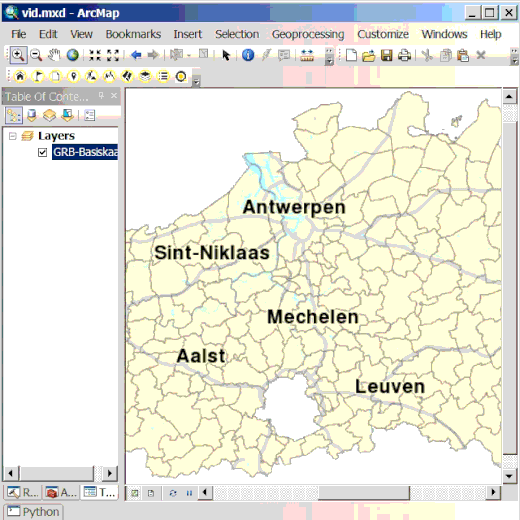

Zoek een adres
==============

  Op basis van een invoer tekstveld wordt gezocht naar een adres in [CRAB](http://www.agiv.be/gis/projecten/?catid=34). Je kiest de gemeente uit een selectielijst en geeft een adres op als invoer tekstveld.  Het invoer tekstveld bevat verplicht een straatnaam en optioneel een huisnummer. Als uitvoer krijg je een lijst met adressen in de vorm (straatnaam huisnummer, gemeente) die voldoen aan de selectie criteria. Het maximaal aantal elementen in de lijst is 25.

Je kan het gewenste adres selecteren door erop te klikken. Als je klikt op de knop **Zoom naar** zoom je naar het adres en wordt dit tijdelijk gemarkeerd op de kaart. De knop **Markeer locatie** laat toe om een graphic en text-annotation te plaatsen op de locatie van het adres.
Met de knop **Toevoegen aan kaart** kan je het adres toevoegen als laag aan de kaart. Deze laag kan je gebruiken in analyses of voor cartografie. Je kunt opslagen naar File Geodatabase of een Shapefile. 

Als je meerdere adressen toevoegt komen die in dezelfde laag terecht. De laag bevat een attribuut '*type*' dat aangeeft hoe de locatie in crab bepaald werd en geeft dus een indicatie van de nauwkeurigheid.

 

[Foute adressen kunt u melden via LARA (enkel voor GDI-Vlaanderen)](http://crab.agiv.be/Lara) 

