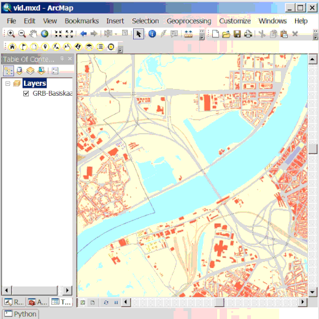

Hoogteprofiel
=============

 De hoogteprofiel-dienst van geopunt, laat toe om hoogte informatie van het digitaal hoogtemodel Vlaanderen op te halen langs een lijn. 
Met deze tool kan je deze informatie ophalen, uitzetten op grafiek en opslaan als kaartlaag.

De knop rechts bovenaan laat toe om het onderliggende hoogtemodel in te laden als laag.

De knop links bovenaan dient om de gewenste profiellijn in te tekenen. 
Klik eenmaal om een punt toe te voegen en dubbelklik om het intekenen van de lijn te beëindigen. 

Als je over profielgrafiek beweegt met je muis wordt de hoogte aangegeven in een blauwe tekstballon. Op de kaart wordt deze locatie aangegeven met een blauw vierkant.

Met knoppenbalk onder het profiel, kan je met de eerste vier knoppen navigeren binnen en inzoomen op een specifiek deel van het profiel.
De vijfde knop is laat toe om het profiel op te slaan als afbeelding. 
De zesde knop laat toe om de grafiek titel te wijzigen, de zevende knop laat je toe een andere vulkleur te kiezen en met de dropdown stel je het teken voor ieder punt in de grafiek in.

Je kunt ook het aantal profielpunten langsheen de lijn instellen. Dit kan met het invoervak rechts onderaan. Met de ververs-knop ernaast kan je het profiel opnieuw ophalen met een ander aantal profielpunten.

Helemaal onderaan vind je de knoppen die toelaten om de enerzijds de opgehaalde profielpunten op te slaan als een puntenlaag en de getekende profiellijn als een lijnenlaag. Bijvoorbeeld om op een kaartafdruk te plaatsen of om andere analyse op te doen.

